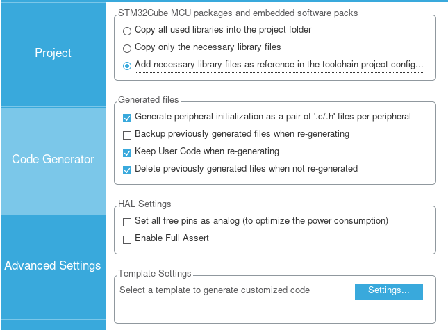
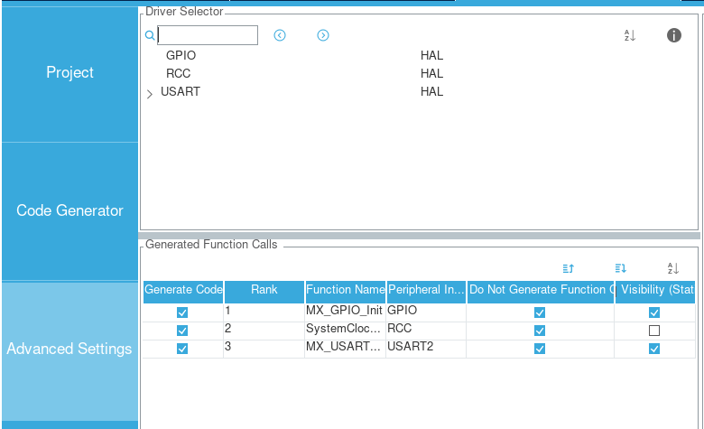
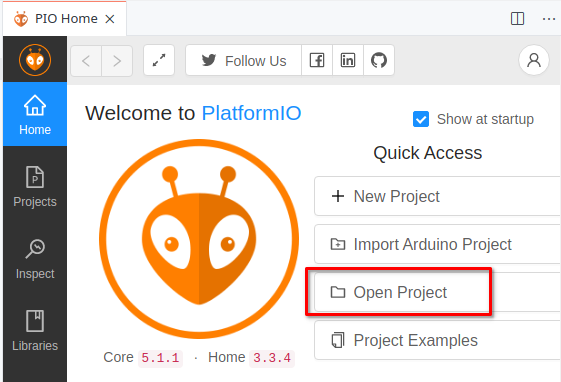

# ucos-iii-STM32L152RE

## Table of Contents

<!-- vim-markdown-toc GFM -->

- [Hardware](#hardware)
- [Toolchain (on Arch Linux)](#toolchain-on-arch-linux)
- [Generate a STM32 project with STM32CubeMX](#generate-a-stm32-project-with-stm32cubemx)
- [Import the project to Platformio](#import-the-project-to-platformio)
- [Porting ucos-iii](#porting-ucos-iii)
- [Problems](#problems)

<!-- vim-markdown-toc -->

## Hardware
- [STM32 Nucleo-L152RE](https://www.st.com/en/evaluation-tools/nucleo-l152re.html)

## Toolchain (on Arch Linux)
- [STM32CubeMX](https://aur.archlinux.org/packages/stm32cubemx/)
- [python](https://archlinux.org/packages/extra/x86_64/python/)
- [platformio](https://docs.platformio.org/en/latest/core/installation.html)

---
>**NOTE:** 
>- Install [pip](https://archlinux.org/packages/extra/any/python-pip/) if you use `Python Package Manager` to install `platformio`. 
>- Use `sudo` to install `platformio` globally. If `platformio` is installed locally then the script location should be added to `PATH` variable.

---
- [stlink](https://archlinux.org/packages/community/x86_64/stlink/)
    - Add [99-platformio-udev.rules](https://raw.githubusercontent.com/platformio/platformio-core/master/scripts/99-platformio-udev.rules) under `/usr/lib/udev/rules.d/` directory for PlatformIO supported boards/devices. 
    ---
    >**NOTE:**
    >- `rules.d` directory might be located in differ path depending which Linux distribution you are using.

    ---
    - Restart `udev`
    ```bash
    sudo udevadm control --reload-rules
    sudo udevadm trigger
    ```
    - Plug `STM32 Nucleo L152RE` in and find info of the device. For example: 
    ```bash
    stat /dev/ttyACM0 
    ```
    ```
      File: /dev/ttyACM0
      Size: 0               Blocks: 0          IO Block: 4096   character special file
    Device: 5h/5d   Inode: 870         Links: 1     Device type: a6,0
    Access: (0666/crw-rw-rw-)  Uid: (    0/    root)   Gid: (  987/    uucp)
    Access: 2021-04-07 15:01:25.817096629 +0300
    Modify: 2021-04-07 15:01:25.817096629 +0300
    Change: 2021-04-07 15:01:25.817096629 +0300
     Birth: -
    ```
    - As in the above output, the device belongs to `uucp` group so you need to add you to `uucp` group
    ```bash
    sudo usermod -a -G uucp $USER
    ```
    ---
    >**NOTE:**
    >- Log out and log in again or restart for the changes to take effect.
    >- Run `groups` command to check if the user is add to `uucp` group
    ---
- [visual-studio-code](https://aur.archlinux.org/packages/visual-studio-code-bin/) and [PlatformIO IDE](https://marketplace.visualstudio.com/items?itemName=platformio.platformio-ide) plug-in.

## Generate a STM32 project with STM32CubeMX
- `STM32CubeMX` > `File` > `New Project` > `Board Selector` > `Commercial Part Number` = `NUCLEO-L152RE` > Select the board > `Start Project`
- Use following settings for the project:
	- `Application Structure`: `Basic` and `Do not generate the main() function`
	- `Toolchain/IDE`: `Other Toolchains`
	- `Add necessary library files as reference in the toolchain project config`
	- `Generate peripheral initialization as a pair of '.c/.h' files per peripheral`
	- `Do Not Generate Function Call` for all functions.
  





- Then `Generate Code`. The generated project will have following files:
```bash
├── Inc
│   ├── gpio.h
│   ├── main.h
│   ├── stm32l1xx_hal_conf.h
│   ├── stm32l1xx_it.h
│   └── usart.h
├── Src
│   ├── gpio.c
│   ├── main.c
│   ├── stm32l1xx_hal_msp.c
│   ├── stm32l1xx_it.c
│   ├── system_stm32l1xx.c
│   └── usart.c
├── template.gpdsc
└── template.ioc
2 directories, 13 files
```
## Import the project to Platformio
- In the generated project directory, create a file named `platformio.ini` with following content:
```ini
[env:nucleo_l152re]
platform = ststm32
board = nucleo_l152re
framework = stm32cube
lib_ldf_mode = chain+
debug_tool = stlink
upload_protocol = stlink
build_flags = -Wl,-Map,./.pio/build/link.map

[platformio]
include_dir = Inc
src_dir = Src
lib_dir = Lib
```
- In VSCode, click  icon on the `Activity Bar` > `Open` >`Open Project`




- After imported, serveral files and directories will be automatically generated.
```bash
├── .gitignore  
├── Inc  
│   ├── gpio.h  
│   ├── main.h  
│   ├── stm32l1xx_hal_conf.h  
│   ├── stm32l1xx_it.h  
│   └── usart.h  
├── .mxproject  
├── .pio  
│   └── build  
│       ├── nucleo_l152re  
│       └── project.checksum  
├── platformio.ini  
├── Src  
│   ├── gpio.c  
│   ├── main.c  
│   ├── stm32l1xx_hal_msp.c  
│   ├── stm32l1xx_it.c  
│   ├── system_stm32l1xx.c  
│   └── usart.c  
├── template.gpdsc  
├── template.ioc  
└── .vscode  
   ├── c_cpp_properties.json  
   ├── extensions.json  
   └── launch.json  
  
6 directories, 20 files
```

## Porting ucos-iii
- Copy and modify `startup_stm32l152xe.S` file
- Fix compiling errors:
	- Enable `CPU_CFG_NVIC_PRIO_BITS` in `cpu_cfg.h` file to fix following error:

	

	- Change `#include  "../../../Source/os.h"`  in `os_cpu_c.c` file to `#include "os.h"` to fix following error:

	

## Problems
- Can't debug when PC13 is enabled. Solutions:
	- Call any `HAL_GPIO_xxx()` function
	- Disable pin `PC13`

